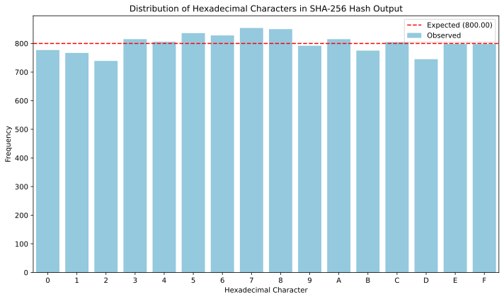
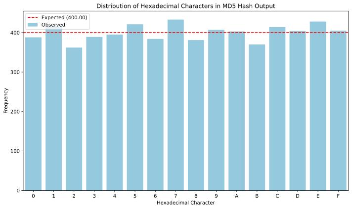
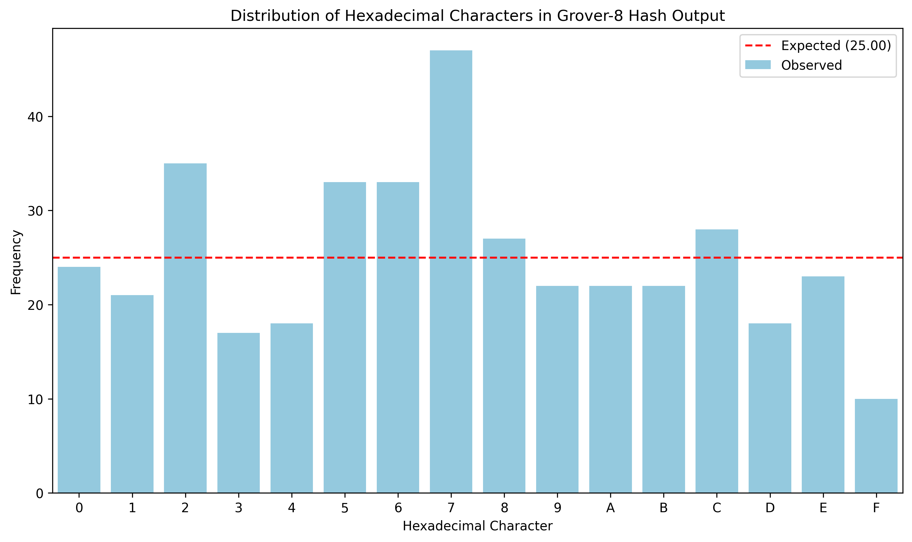
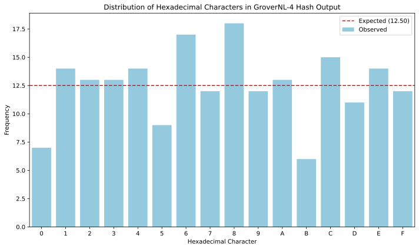
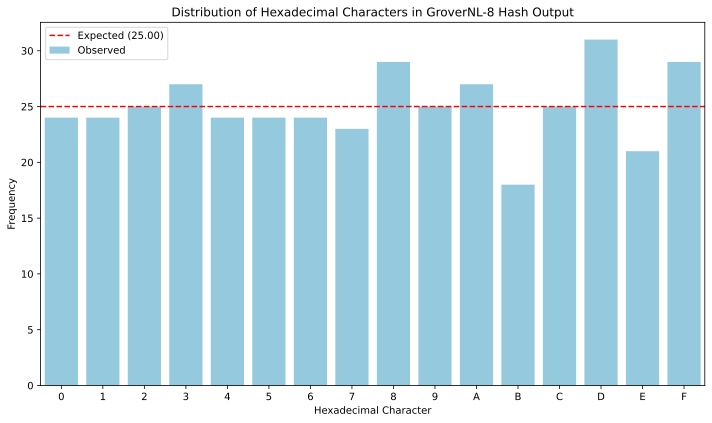
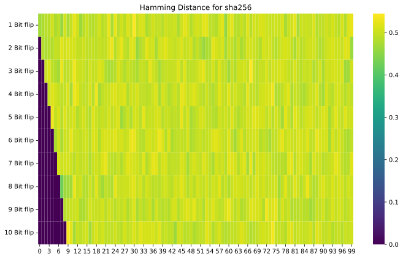
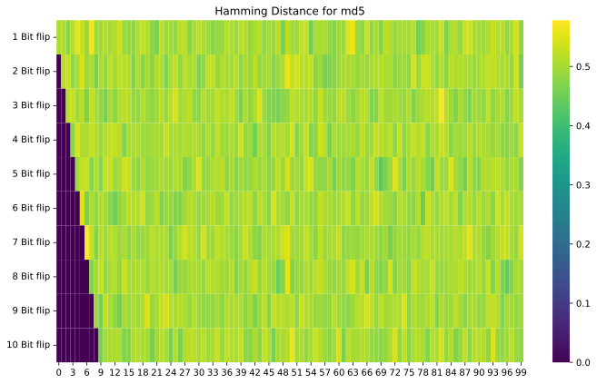
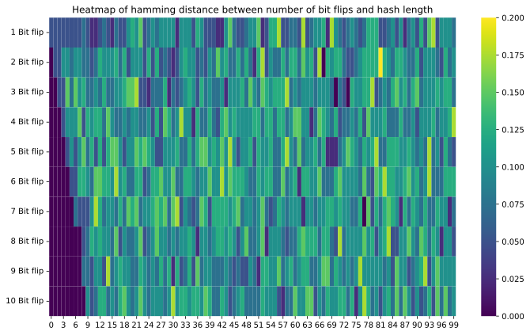
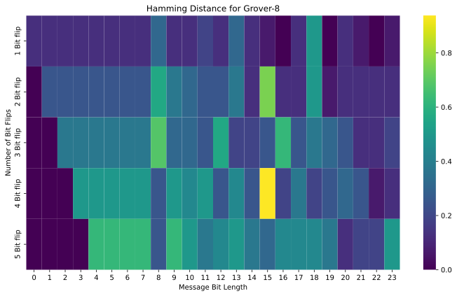
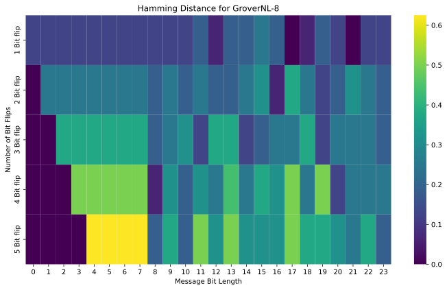

# Hashing Comparison Report
Comparing Grover's Hashing (3, 4, 8 qubits) to SHA-256 and MD5 for uniformity (Chi-Squared Test) and Hamming distance.

## 1. Uniformity Test Results
| Algorithm | Chi2 Statistic | DoF | Critical Value (alpha=0.05) | Passed Uniformity? |
|-----------|----------------|-----|-----------------------------|--------------------|
| SHA-256           |         21.335 |  15 |                      24.996 | Yes                |
| MD5               |         15.290 |  15 |                      24.996 | Yes                |
| Grover (3 Qubits) |         34.400 |   7 |                      14.067 | No                 |
| Grover (4 Qubits) |         14.720 |  15 |                      24.996 | Yes                |
| Grover (8 Qubits) |         46.400 |  15 |                      24.996 | No                 |
| GroverNL (4 Qubits) |         12.160 |  15 |                      24.996 | Yes                |
| GroverNL (8 Qubits) |          6.000 |  15 |                      24.996 | Yes                |

## 2. Average Normalized Hamming Distance (Target: 0.50)
| Algorithm | 1-bit Flip | 2-bit Flips | 3-bit Flips | 4-bit Flips | 5-bit Flips |
|-----------|------------|-------------|-------------|-------------|-------------|
| SHA-256           | 0.496 | 0.498 | 0.504 | 0.499 | 0.495 |
| MD5               | 0.500 | 0.505 | 0.487 | 0.498 | 0.505 |
| Grover (3 Qubits) | 0.058 | 0.125 | 0.150 | 0.275 | 0.283 |
| Grover (4 Qubits) | 0.117 | 0.142 | 0.217 | 0.325 | 0.342 |
| Grover (8 Qubits) | 0.138 | 0.267 | 0.254 | 0.383 | 0.367 |
| GroverNL (4 Qubits) | 0.058 | 0.067 | 0.108 | 0.175 | 0.300 |
| GroverNL (8 Qubits) | 0.171 | 0.250 | 0.279 | 0.375 | 0.396 |

## 3. Visualization Plots
### 3.1 Uniformity Distributions

### 3.2 Hamming Distance Heatmaps

