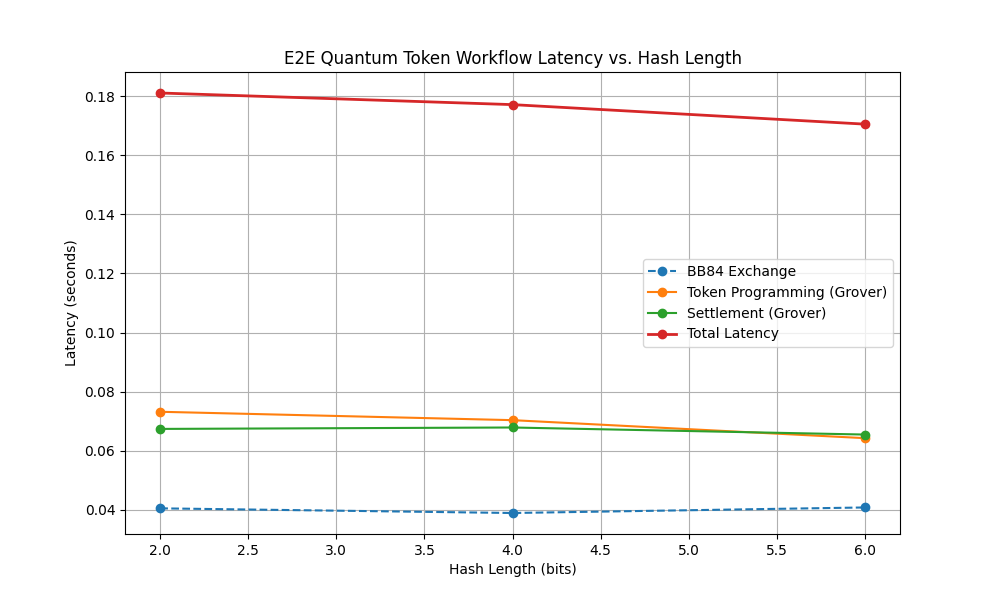

# Quantum Token E2E Testing Workflow

This document explains the end-to-end (E2E) testing workflow for the relativistic quantum token system.

## Workflow Overview

The token lifecycle involves three primary entities and sequential phases:

1. **BankNode**: The centralized issuer that maintains an SQLite ledger.
2. **AliceNode**: The token requester/programmer.
3. **CharlieNode**: The proxy node resolving the final settlement.

### Phase 1: Key Generation (BB84 Exchange)
Alice and the Bank execute a BB84 protocol over a quantum channel. The bank generates a `serial_number` and stores it alongside the derived `shared_secret` with an `ACTIVE` status in the ledger.

### Phase 2: Token Programming
Alice prepares the token for a specific merchant/location (`target_geohash`) and time limit (`expiration_timestamp`). She signs these constraints using a Grover-based Amplitude-Amplification-Hash (AAH) quantum circuit. This generates a computationally unclonable signature from the `shared_secret`.

### Phase 3: Settlement
Alice presents the token to Charlie, who appends his local observation (`current_time`, `current_geohash`). He proxies this bundle to the Bank. The Bank verifies the temporal and geographic validity, reconstructs the expected AAH string, and re-runs the quantum hash verification. If valid, the DB status is updated to `SPENT`.

## Adversarial Edge Cases Verified
- **Geographic Spoofing**: Submitting from a mismatched location.
- **Temporal Expiration**: Attempting to settle after the expiration deadline.
- **Data Tampering**: Falsifying data payloads after AAH signature computation.
- **Double Spending**: Concurrently submitting the same valid token multiple times.

## Performance Metrics

The chart below shows the latency overhead for each phase depending on the simulated Grover Hash length.

As shown in the graph, the Grover-based phases (Programming and Settlement) scale exponentially in latency based on the chosen signature hash length, while the BB84 exchange time remains mostly stable as it uses a fixed 128-bit channel simulation.
