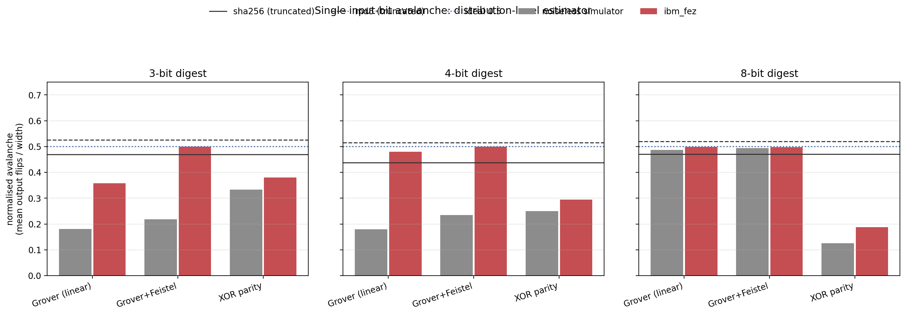
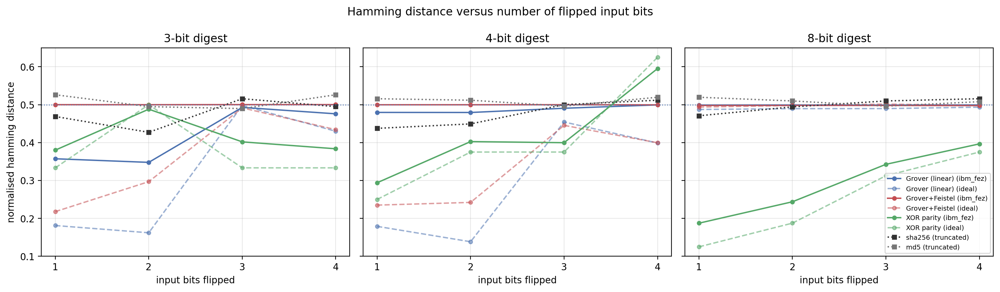
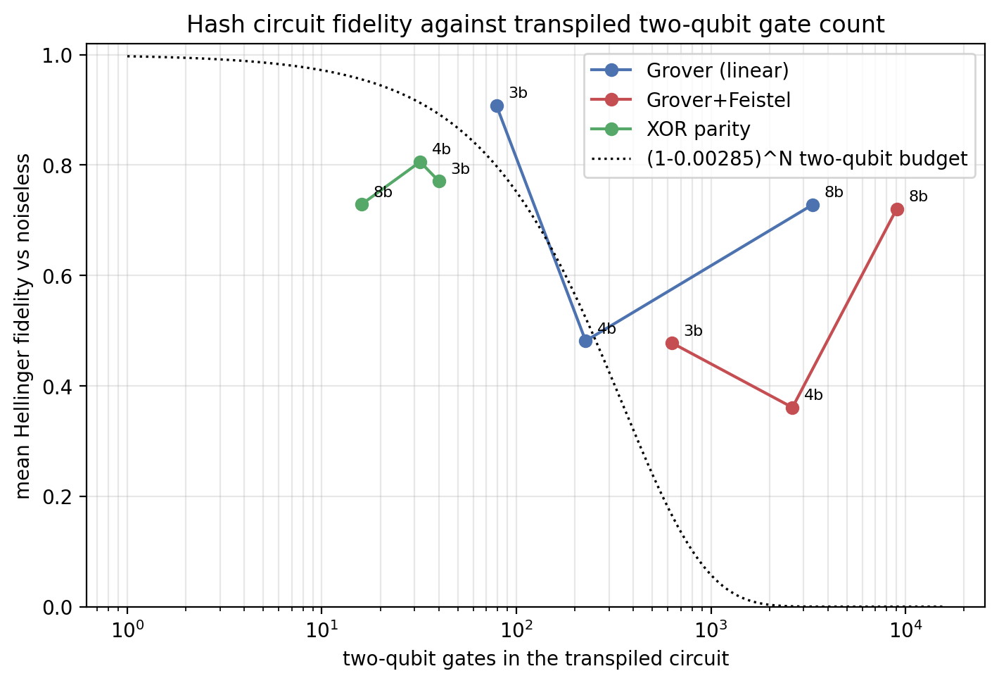
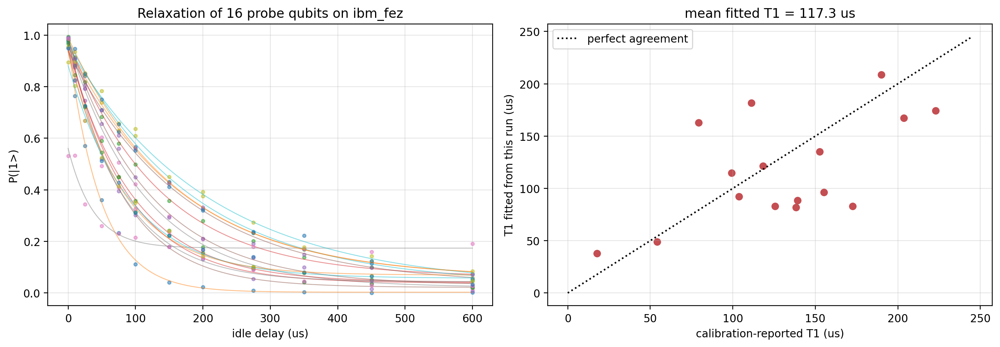
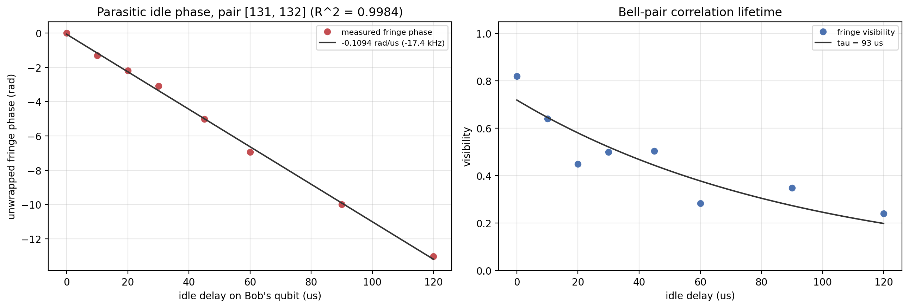
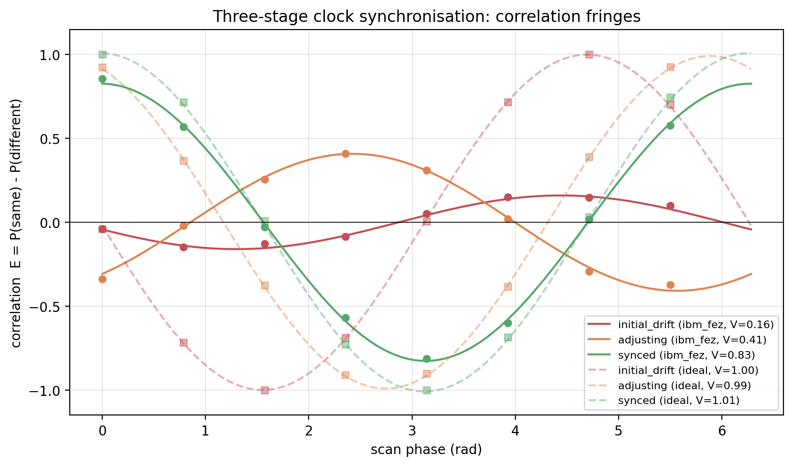
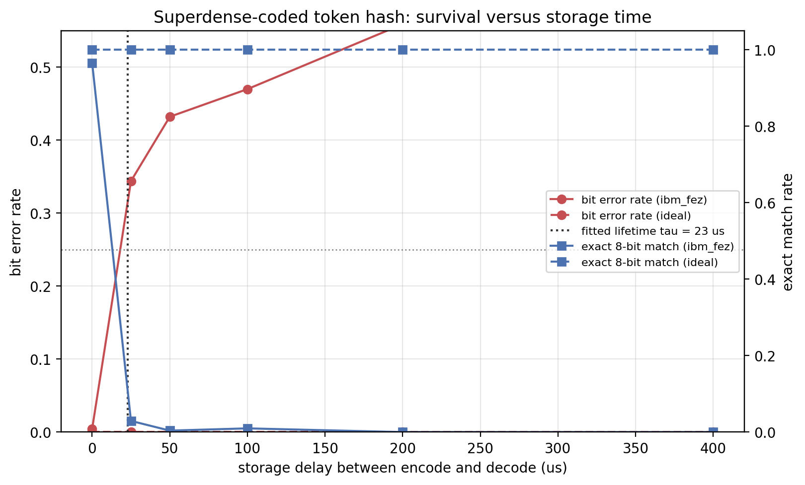
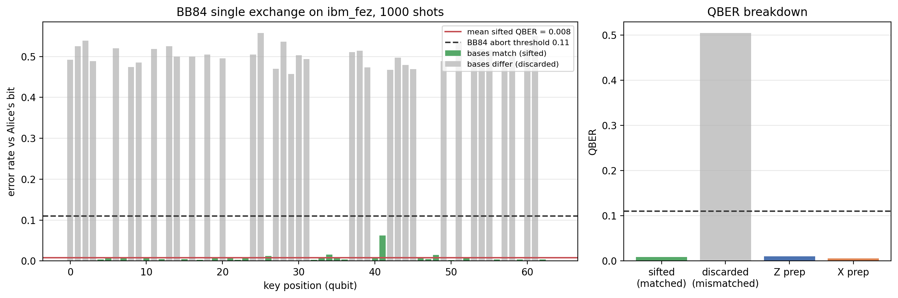

# IBM Quantum hardware run `ibmq_20260908T220749Z`

## Device

- **QPU: `ibm_fez`** (156 qubits, Heron 2)
- Calibrated 2026-09-08T21:35:35+00:00 (0.542 h before selection)
- Median T1 138.58 us, median T2 100.03 us
- Median 2-qubit (cz) error 0.00285, median readout error 0.009521
- Instance `qpus` (us-east), channel `ibm_quantum_platform`
- Selection rule: operational, >=27 qubits, calibration age <= 24 h, queue depth <= 20 pending jobs, ranked by median 2-qubit gate error then calibration freshness

Candidates surveyed at selection time:

| backend | qubits | calibration age (h) | median 2q error | median readout error | median T1 (us) | median T2 (us) | queue |
|---|---|---|---|---|---|---|---|
| `ibm_kingston` | 156 | 0.803 | 0.002029 | 0.008911 | 228.58 | 139.32 | 186 |
| `ibm_fez` **(chosen)** | 156 | 0.533 | 0.00285 | 0.009521 | 138.58 | 100.03 | 3 |
| `ibm_marrakesh` | 156 | 0.623 | 0.003112 | 0.012451 | 168.87 | 66.95 | 1 |

Full per-qubit calibration snapshot: `calibration_ibm_fez.json` (156 qubits, 352 calibrated pairs).

- Jobs submitted: 18; billed QPU time 212.00 s (open plan grants 600 s / 28 days)

| job id | tag | circuits | shots | quantum seconds |
|---|---|---|---|---|
| `dag8q7b9k43c73ad1bfg` | bb84_single_exchange | 1 | 1000 | 2.00 |
| `dag8qdomhr3c73e4qdd0` | sdc_protocol | 4 | 1024 | 3.00 |
| `dag8qgvi3e6s738m2spg` | sdc_token | 1 | 1024 | 2.00 |
| `dag8qk0mhr3c73e4qdkg` | sdc_decay | 6 | 1024 | 5.00 |
| `dag8qqphvn6c73cq908g` | qcs_t1 | 12 | 512 | 5.00 |
| `dag8quhhvn6c73cq90dg` | qcs_sync | 24 | 1024 | 10.00 |
| `dag8r3b9k43c73ad1ckg` | qcs_chsh | 4 | 1024 | 3.00 |
| `dag8r9omhr3c73e4qeeg` | grover_3bit | 40 | 1024 | 13.00 |
| `dag8rivi3e6s738m2u90` | grover_4bit | 40 | 1024 | 14.00 |
| `dag8ruj9k43c73ad1dr0` | grover_8bit | 40 | 1024 | 24.00 |
| `dag8sb0mhr3c73e4qg10` | feistel_3bit | 40 | 1024 | 15.00 |
| `dag8slomhr3c73e4qgd0` | feistel_4bit | 40 | 1024 | 21.00 |
| `dag8ta8mhr3c73e4qh00` | feistel_8bit | 40 | 1024 | 34.00 |
| `dag8trr9k43c73ad1geg` | simple_xor_3bit | 40 | 1024 | 13.00 |
| `dag8udfi3e6s738m32dg` | simple_xor_4bit | 40 | 1024 | 13.00 |
| `dag8ulb9k43c73ad1i20` | simple_xor_8bit | 40 | 1024 | 13.00 |
| `dag90mphvn6c73cq9930` | qcs_phase_cal | 32 | 1024 | 12.00 |
| `dag90vni3e6s738m36j0` | qcs_sync | 24 | 1024 | 10.00 |

## Hashing

Three constructions at 3, 4 and 8 bits, all fed the same 16-bit input space. `fidelity vs ideal` is the mean Hellinger fidelity between the hardware and noiseless output distributions; `avalanche` is the distribution-level estimator E[HD] over a single input-bit flip, normalised by the digest width (0.5 is ideal).

| construction | width | iters | qubits | ISA depth | 2q gates | fidelity vs ideal | top-1 agreement | surviving signal | avalanche (hw) | avalanche (ideal) | entropy hw/ideal | distinct top-1 |
|---|---|---|---|---|---|---|---|---|---|---|---|---|
| Grover (linear) | 3 | 2 | 3 | 284 | 79 | 0.908 | 0.90 | 0.703 | 0.357 | 0.181 | 2.90/2.78 | 7/12 |
| Grover (linear) | 4 | 3 | 4 | 887 | 227 | 0.481 | 0.75 | 0.227 | 0.480 | 0.179 | 3.98/3.59 | 11/12 |
| Grover (linear) | 8 | 2 | 8 | 8721 | 3339 | 0.728 | 0.00 | 0.723 | 0.499 | 0.487 | 7.97/7.81 | 12/12 |
| Grover+Feistel | 3 | 2 | 4 | 2227 | 630 | 0.478 | 0.40 | 0.059 | 0.500 | 0.218 | 3.00/2.78 | 5/12 |
| Grover+Feistel | 4 | 3 | 6 | 6679 | 2625 | 0.361 | 0.05 | 0.061 | 0.500 | 0.235 | 4.00/3.59 | 5/12 |
| Grover+Feistel | 8 | 2 | 12 | 16551 | 9023 | 0.721 | 0.00 | 0.725 | 0.498 | 0.494 | 7.97/7.82 | 11/12 |
| XOR parity | 3 | - | 19 | 42 | 40 | 0.771 | 1.00 | 0.742 | 0.380 | 0.333 | 2.67/2.22 | 6/12 |
| XOR parity | 4 | - | 20 | 29 | 32 | 0.806 | 1.00 | 0.782 | 0.294 | 0.250 | 3.46/2.86 | 8/12 |
| XOR parity | 8 | - | 24 | 8 | 16 | 0.729 | 1.00 | 0.937 | 0.187 | 0.125 | 5.09/3.58 | 12/12 |

Read the three hardware columns together: `fidelity vs ideal` saturates near 1 whenever the noiseless distribution is itself almost flat, `top-1 agreement` asks whether the argmax the protocol would use is the right one, and `surviving signal` is how much of the noiseless distribution's distance from uniform is left.

Classical references, same widths, digests truncated to the same number of bits:

| algorithm | width | 1-flip avalanche | 4-flip avalanche | entropy | chi2 uniform |
|---|---|---|---|---|---|
| sha256 | 3 | 0.469 | 0.495 | 3.00 | yes |
| sha256 | 4 | 0.438 | 0.512 | 4.00 | yes |
| sha256 | 8 | 0.471 | 0.516 | 7.96 | yes |
| md5 | 3 | 0.526 | 0.526 | 3.00 | yes |
| md5 | 4 | 0.516 | 0.520 | 4.00 | yes |
| md5 | 8 | 0.520 | 0.508 | 7.95 | yes |







## Quantum clock synchronisation

Relaxation measured on 16 probe qubits ([0, 9, 18, 27, 36, 45, 54, 63, 72, 81, 90, 99, 108, 117, 126, 135]), delays [0, 10, 25, 50, 75, 100, 150, 200, 275, 350, 450, 600] us, 512 shots each:

- **Mean fitted T1 = 117.3 us** (median 105.5, sd 49.8, range 37.7-208.7)
- Device-reported mean over the same qubits: 130.2 us
- Fits converged for 16/16 probes



### Idle-phase calibration

An idling qubit accumulates phase the rotating frame does not track. Left unmeasured this is indistinguishable from the clock offset the protocol is trying to recover, so it is calibrated first by sweeping the idle time with no deliberate drift applied.

- **Idle phase rate -0.1094 rad/us** (-17.41 kHz residual detuning), linear fit R^2 = 0.9984
- Phase wraps every 57.4 us, which bounds the unambiguous offset range
- Bell-pair correlation lifetime tau = 93.3 us (device median T2 is 100.03 us)

| idle delay (us) | fringe visibility | fringe phase (rad) |
|---|---|---|
| 0 | 0.819 | +0.006 |
| 10 | 0.640 | -1.304 |
| 20 | 0.449 | -2.196 |
| 30 | 0.499 | -3.099 |
| 45 | 0.504 | -5.013 |
| 60 | 0.284 | -6.947 |
| 90 | 0.349 | -10.003 |
| 120 | 0.241 | -13.028 |



### Three stages

Pair [131, 132] (cz error 0.00115). T1 used: 117.3 us (measured on ibm_fez (t1_relaxation.json)); omega = 0.01339 rad/us, so a full-T1 offset is a quarter turn of deliberate phase. Idle phase rate applied in the analysis: -0.1094 rad/us (measured on ibm_fez (idle_phase_calibration.json)).

| stage | offset dt (us) | applied phase (rad) | E(phi=0) | anti-correlated % | visibility | measured fringe phase (rad) |
|---|---|---|---|---|---|---|
| initial_drift | 117.3 | 1.5708 | -0.039 | 51.95 | 0.160 | +1.842 |
| adjusting | 29.3 | 0.3927 | -0.338 | 66.89 | 0.408 | -2.424 |
| synced | 0.0 | 0.0000 | +0.857 | 7.13 | 0.826 | +0.009 |

Offset recovery after subtracting the calibrated idle phase (total rate -0.0960 rad/us, unambiguous only below 65.5 us of offset):

| stage | predicted phase (rad) | model residual (rad) | wraps | recovered offset (us) | error (us) |
|---|---|---|---|---|---|
| initial_drift | -11.261 | +0.536 | -2 | +111.7 | -5.6 |
| adjusting | -2.815 | +0.391 | 0 | +25.3 | -4.1 |
| synced | -0.000 | +0.009 | 0 | -0.1 | -0.1 |



CHSH on the same pair: **S = 2.4727** (classical bound 2, Tsirelson 2.8284) - violates the classical bound, so the correlations above are genuinely entangled.

## Superdense coding

Baseline, four 2-bit messages over one Bell pair, 1024 shots each:

| message | accuracy | fidelity vs ideal |
|---|---|---|
| 00 | 0.9961 | 0.9961 |
| 01 | 0.9922 | 0.9922 |
| 10 | 0.9941 | 0.9941 |
| 11 | 0.9883 | 0.9883 |

Mean accuracy **0.9927** (sd 0.0033), per-bit error rate 0.0038.

Token hash `10011101` (GroverHash-8 of `serial=QT-0001|geo=u2vh|exp=1789000000`) sent over 4 Bell pairs:

- exact 8-bit match rate **0.9609**
- mean bit error rate 0.0050, mean hamming distance 0.040 bits
- per-bit error rate [0.0068, 0.0049, 0.001, 0.0068, 0.0078, 0.0039, 0.001, 0.0078] (worst bit 4)

Storage window between encoding and decoding:

| delay (us) | bit error rate | exact match rate |
|---|---|---|
| 0 | 0.0044 | 0.9658 |
| 25 | 0.3439 | 0.0293 |
| 50 | 0.4320 | 0.0039 |
| 100 | 0.4698 | 0.0098 |
| 200 | 0.5588 | 0.0000 |
| 400 | 0.6001 | 0.0000 |

- fitted payload lifetime tau = 22.9 us (R^2 0.938)
- last delay still decoding the whole hash more than half the time: 0 us
- bit error rate crosses 0.25 at 18 us



## BB84

One exchange of 64 prepared qubits, 1000 shots.

- sifted 28/64 positions (rate 0.438, expected 0.5)
- single shot (shot 0): QBER 0.0000 over 28 sifted bits, key `73376FC`
- 1000-shot mean sifted QBER **0.0084** (sd 0.0111, range 0.001-0.062)
- control: mismatched-basis QBER 0.5044 (expected 0.5)
- by preparation basis: Z 0.0103, X 0.0055
- **key usable after error correction** (threshold 0.11)



## Against the numbers already in the thesis

Prior hardware figures quoted in `chapters/results.tex` for comparison. Different devices and different generations, so read these as context rather than as a controlled comparison.

| quantity | previously reported | this run (`ibm_fez`) |
|---|---|---|
| T1 relaxation | 433.16 us (ibm_brussels, Eagle r3) | 117.3 us mean over 16 probes |
| synchronised correlation | 77.4% | 85.7% |
| offset-applied correlation | 58.5% (Alice delayed), 53.5% (Bob delayed) | 33.8% at 0.25xT1, 3.9% at 1.0xT1 |
| Grover hash width usable on hardware | downscaled from 8-bit to 3-bit (ibm_kingston) | 3-bit top-1 agreement 0.90, 8-bit 0.00 - same conclusion, now with the gate counts that cause it |

New in this run and not previously measured: the Feistel (non-linear) oracle on hardware at all three widths, the idle-phase calibration that makes the recovered clock offset meaningful, a CHSH test certifying the entanglement the sync and superdense stages depend on, superdense transmission of a complete token hash with its storage lifetime, and SHA-256/MD5 baselines truncated to the same digest widths.

## Reproducing

```
venv/bin/python experiments/ibm/select_backend.py
venv/bin/python experiments/ibm/classical_baselines.py
venv/bin/python experiments/ibm/exp_bb84.py --submit
venv/bin/python experiments/ibm/exp_superdense.py --submit
venv/bin/python experiments/ibm/exp_qcs.py --submit
venv/bin/python experiments/ibm/exp_hashing.py --submit
venv/bin/python experiments/ibm/make_report.py --run-id ibmq_20260908T220749Z
```
